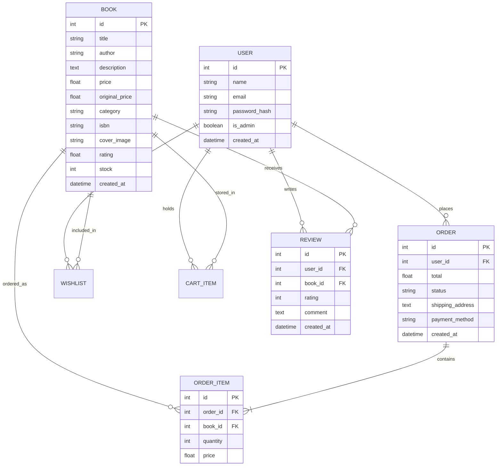

# 📚 Book Ninja

> A full-featured bookstore e-commerce web application featuring a hand-drawn, literary aesthetic.

[](https://python.org)
[](https://flask.palletsprojects.com/)
[](https://sqlite.org/)
[](https://getbootstrap.com/)

---

## 📖 Table of Contents
- [Overview](#-overview)
- [Key Features](#-key-features)
- [Design System](#-design-system)
- [Tech Stack](#-tech-stack)
- [Quick Start](#-quick-start)
- [Demo Credentials](#-demo-credentials)
- [Project Structure](#-project-structure)
- [Database Architecture](#-database-architecture)
- [Business Rules & Business Logic](#-business-rules--business-logic)
- [Troubleshooting](#-troubleshooting)

---

## 🌟 Overview

**Book Ninja** combines modern e-commerce mechanics with a uniquely curated, editorial design layout. Built with Flask and Bootstrap 5, it offers a seamless shopping experience for readers alongside a full administration dashboard for store managers.

---

## ✨ Key Features

### 🛒 Customer Experience
* **Catalog Discovery:** Full-text search, multi-criteria filtering, and dynamic sorting.
* **Book Details & Community Reviews:** Detailed item views with verified customer ratings and commentary.
* **Persistent Cart & Wishlist:** Database-backed user state that persists across sessions.
* **Streamlined Checkout:** Simulated checkout supporting Cash on Delivery and Demo Card payments.
* **Order History:** Full order tracking and itemized historical receipts.

### ⚙️ Administration
* **Analytics Dashboard:** Overview metrics detailing store inventory and activity.
* **Catalog Management:** Complete CRUD operations for adding, editing, and deleting titles.
* **Inventory Control:** Real-time stock counts and dynamic price adjustments.

---

## 🎨 Design System

Designed around a warm, editorial, hand-drawn literary aesthetic.

| Element | Specification |
| :--- | :--- |
| **Color Palette** | Warm off-white background (`#FAFAFA`), Near-black ink text (`#1A1A1A`), Warm brown accent (`#8C6D46`) |
| **Typography** | `Permanent Marker` (Headings), `Patrick Hand` (Subtitles/Accents), `Inter` (UI/Body) |
| **Visual Tone** | Minimalist, spacious, tactile, editorial |

---

## 🛠️ Tech Stack

* **Backend:** Python, Flask, Flask-SQLAlchemy, Flask-Login, Jinja2
* **Frontend:** HTML5, CSS3, Bootstrap 5, JavaScript (ES6+)
* **Database:** SQLite

---

## 🚀 Quick Start

### Prerequisites
* Python 3.8+ installed on your system.

### Installation & Run Steps

1. **Clone the repository and enter the directory:**
   ```bash
   git clone https://github.com/your-username/book-ninja.git
   cd book-ninja
   ```

2. **Create and activate a virtual environment:**
   * **macOS / Linux:**
     ```bash
     python3 -m venv venv
     source venv/bin/activate
     ```
   * **Windows:**
     ```cmd
     python -m venv venv
     venv\Scripts\activate
     ```

3. **Install dependencies:**
   ```bash
   pip install -r requirements.txt
   ```

4. **Initialize and seed the database:**
   ```bash
   python database/seed.py
   ```

5. **Start the application:**
   ```bash
   python app.py
   ```

6. Open your browser and navigate to **`http://127.0.0.1:5000`**

---

## 🔑 Demo Credentials

### Primary Test Accounts

| Role | Email | Password | Access Level |
| :--- | :--- | :--- | :--- |
| **Admin** | `admin@bookninja.com` | `admin123` | Full Dashboard & Inventory Management |
| **Customer** | `john@example.com` | `password123` | Standard Shopping & Review Access |

### Additional Customer Accounts
| User | Email | Password |
| :--- | :--- | :--- |
| **Jane Smith** | `jane@example.com` | `password123` |
| **Bob Wilson** | `bob@example.com` | `password123` |
| **Alice Johnson** | `alice@example.com` | `password123` |

---

## 📁 Project Structure

```text
book-ninja/
├── app.py                  # Application entry point & route initialization
├── config.py               # Application configuration settings
├── models.py               # SQLAlchemy models
├── requirements.txt        # Python dependency manifest
├── database/
│   └── seed.py             # Database seed data script
├── static/
│   ├── css/
│   │   └── style.css       # Custom aesthetic overrides & styles
│   └── js/
│       └── app.js          # Client-side UI logic
└── templates/
    ├── index.html          # Landing homepage
    ├── books.html          # Browse catalog page
    ├── book_detail.html    # Book product detail page
    ├── cart.html           # Shopping cart view
    ├── checkout.html       # Checkout & payment flow
    ├── orders.html         # User order history
    ├── login.html          # Authentication login
    ├── register.html       # Account registration
    ├── wishlist.html       # Saved wishlist books
    ├── admin/              # Management interface
    │   ├── dashboard.html  # Store statistics dashboard
    │   ├── books.html      # Book management table
    │   └── book_form.html  # Book creation/edit view
    └── partials/           # Reusable Jinja template partials
        ├── navbar.html
        ├── footer.html
        ├── book_card.html
        └── flash_messages.html
```

---

## 🗄️ Database Architecture



---

## 📌 Business Rules & Business Logic

* **Shipping Threshold:** Free standard shipping on orders **₹500+**, otherwise a flat **₹50** fee is applied at checkout.
* **Review Policy:** Restricted to authenticated accounts; maximum of **1 review per book** per account.
* **Pricing Persistence:** Historical order items lock in the exact `price` at the instant of purchase, guaranteeing price history accuracy even if catalog prices change later.
* **Access Rights:** Admin portal routes are protected by role-based checks (`is_admin=True`).

---

## 🔧 Troubleshooting

### Database Reset
If you encounter migration issues or want a clean slate:

* **macOS / Linux:**
  ```bash
  rm -f instance/bookstore.db
  python database/seed.py
  ```

* **Windows (Command Prompt):**
  ```cmd
  del /f instance\bookstore.db
  python database/seed.py
  ```

* **Windows (PowerShell):**
  ```powershell
  Remove-Item -Force instance\bookstore.db
  python database/seed.py
  ```
